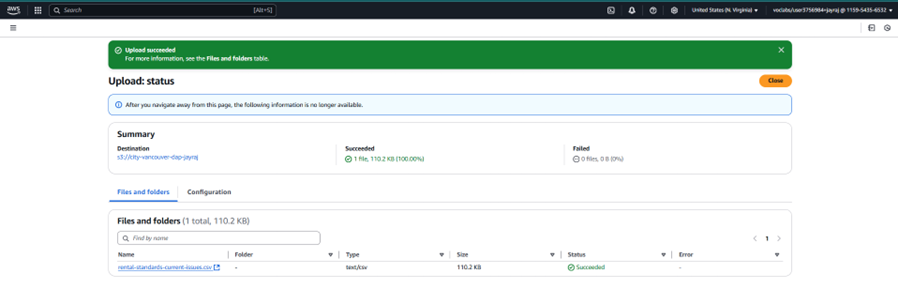
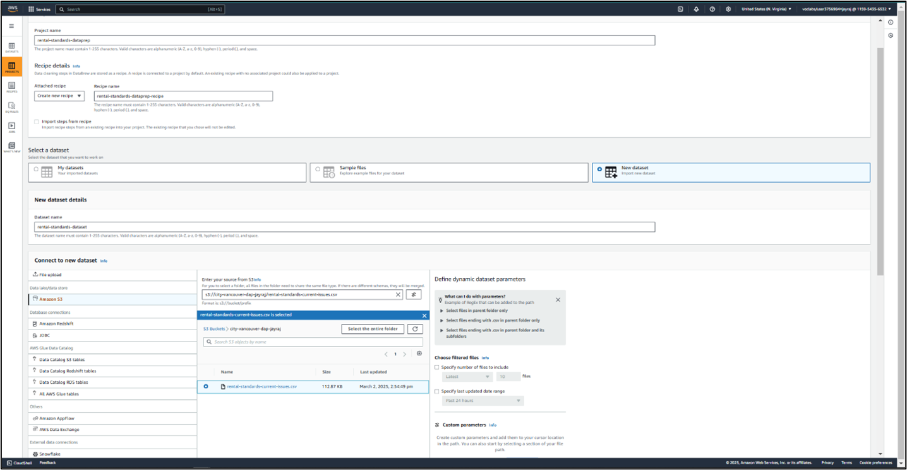
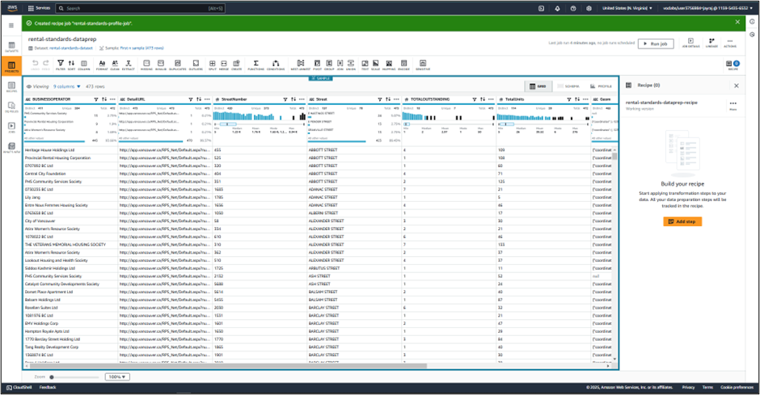
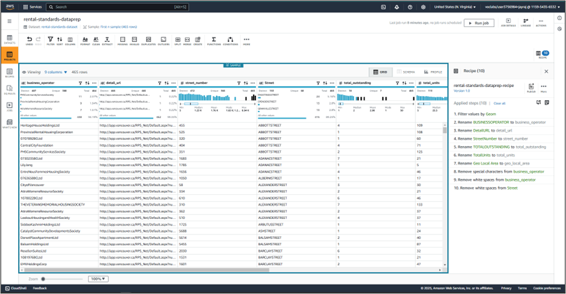
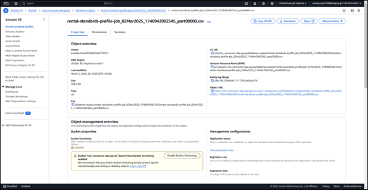
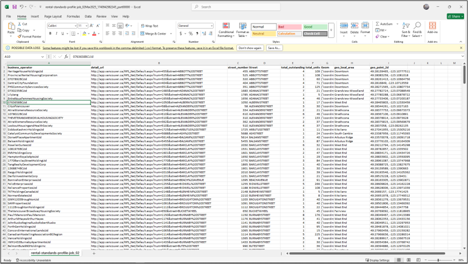
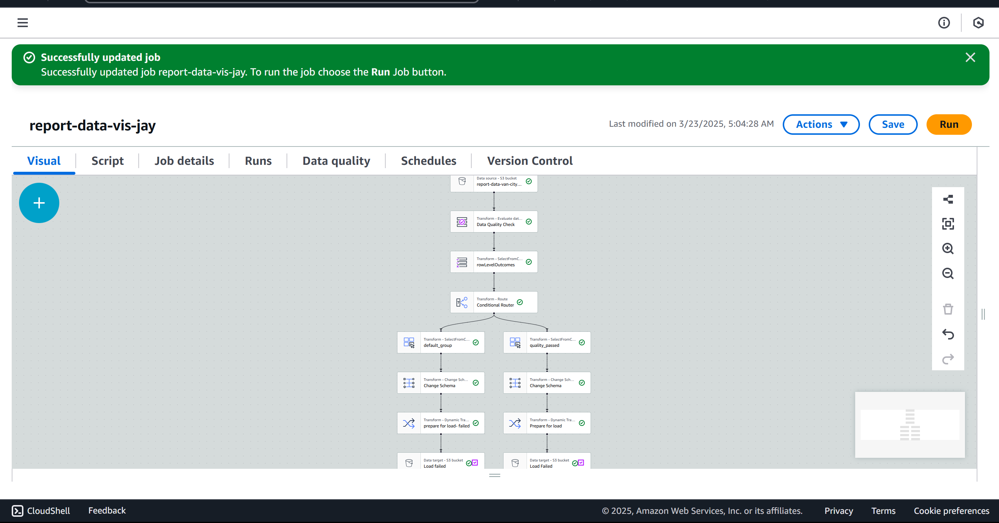

# Data-Analyst-Jayraj Rathod
# Project 1 - Jayraj Rathod (2304652)

## Descriptive Analysis
Water quality and regulatory compliance are essential for urban infrastructure, ensuring public health and environmental sustainability. The City of Vancouver maintains detailed records of operating permits for water systems and water quality reports. These records provide critical insights into permit conditions, regulatory compliance, and the overall quality of operating water systems.

This project involves analyzing data on operating permits for water systems. The dataset consists of 465 entries, each containing:
- Operating permit number
- System address
- Mechanical system type (e.g., building water treatment, cooling water system)
- Current system status (active/inactive)
- Permit renewal date

Additional irrelevant information was also present and addressed during the data cleaning process.

## Step 1: Data Ingestion
The dataset, `rental-standards-current-issues.csv`, was ingested into AWS DataBrew from an S3 bucket named `city-vancouver-dap-jayraj`. AWS DataBrew enables seamless integration with S3, allowing direct imports into data processing environments (Oteng, 2024).

**Process:**
- Selected dataset from S3
- Auto-detected schema using DataBrew
- Configured settings: first row as headers, comma as delimiter
- Saved dataset as `rental-standards-dataset` in DataBrew

**Image 1: Data Ingestion Process**

## Step 2: Data Profiling
A profiling job was created to generate summary statistics on the dataset. Data profiling helps assess data quality, completeness, and potential issues before cleaning (Agrawal, 2024).

**Profiling Insights:**
- Distinct values per column
- Missing values identification
- Numeric and categorical distributions

The profiling output was stored in the `databrew-output` folder in S3.

## Step 3: Data Cleaning
Data cleaning was performed using a DataBrew recipe to apply transformations systematically. The following operations were applied:
- Removed rows with missing `Geom` values to ensure valid geolocation data.
- Renamed columns for consistency (e.g., `BUSINESSOPERATOR` → `business_operator`).
- Removed special characters and extra whitespace from `business_operator` and `Street` columns.

The cleaned dataset was saved in S3 under `databrew-output`.

## Step 4: Data Cataloging
The cleaning recipe was published to AWS DataBrew, ensuring repeatability and auditability (Pradeep-Misra, 2021). This allowed:
- Versioning of cleaning steps
- Easy retrieval of cleaned datasets and transformation history

The final dataset and cleaning recipe were stored in S3 for future use.

## Step 5: Data Summarization
Key insights derived from profiling, cleaning, and transformation:

- **Initial Dataset:** 473 rows, 9 columns
- **Final Dataset:** 465 rows after removing 8 rows with missing `Geom` values
- **Standardization:** Column names updated, special characters removed
- **Data Stored:** Final dataset saved to S3

### Summary of Key Findings:
- **business_operator:** 411 distinct operators; some managing multiple properties.
- **geo_local_area:** Downtown had the highest concentration of properties.
- **total_units:** Property sizes varied from a few units to over 200.
- **Data Quality:** Missing coordinates were identified and addressed.

---

### 🔗 References
1. Oteng, M. (2024). AWS DataBrew for Data Ingestion. 
2. Agrawal, R. (2024). Importance of Data Profiling.
3. Pradeep-Misra, S. (2021). Data Cataloging Best Practices.

---
## Project Part2 : Water Quality Analysis

### **Descriptive Analysis**
Water quality and regulatory compliance are critical components of urban infrastructure, ensuring public health and environmental sustainability. The City of Vancouver maintains precise records of operating permits for water systems and water quality reports to track and ensure water safety. These records provide insights into the management of water infrastructure, including permit conditions, regulatory compliance, and overall water system quality.

I used data from operating permits for water systems, containing 465 entries. Each entry includes an operating permit number, system address, mechanical system type (e.g., building water treatment systems, cooling water system), current system status (active or inactive), and permit renewal date. Some irrelevant data was also present.

### **Step 1: Data Ingestion**
The dataset file named `rental-standards-current-issues.csv` was ingested into AWS DataBrew from an S3 bucket (`city-vancouver-dap-jayraj`). AWS DataBrew provides native S3 integration, allowing direct file imports.

- The dataset schema was automatically detected.
- Headers were assigned correctly, and a comma was specified as the delimiter.
- The dataset was saved in DataBrew as `rental-standards-dataset`.

### **Step 2: Data Profiling**
A data profiling job was created to generate summary statistics. This process assessed data quality, structure, and completeness, identifying potential data issues before cleaning.

- Profiling results, including distinct values, missing values, and distributions, were stored in `databrew-output` within S3.

### **Step 3: Data Cleaning**
Data cleaning was performed using a DataBrew recipe, applying transformations such as:

- Removing rows with missing geolocation values.
- Renaming columns for consistency (e.g., `BUSINESSOPERATOR` → `business_operator`).
- Removing special characters and whitespace.

The cleaned dataset was then saved to `databrew-output` in S3.

### **Step 4: Data Cataloging**
The cleaning recipe was published in AWS DataBrew for future use, ensuring repeatability and compliance with data governance policies.

### **Step 5: Data Summarization**
Key insights from the analysis:

- The dataset originally contained 473 rows; 8 rows with missing geolocation values were removed.
- 411 distinct business operators were identified.
- Properties were mainly concentrated in Downtown.
- Property sizes varied significantly, with some exceeding 200 units.

---

## **DAP Implementation – Jayraj**

### **ETL Pipeline with AWS Glue**
The objective was to construct an ETL pipeline using AWS Glue to analyze `Operating Permits - Water Systems` data from the City of Vancouver. The key goal was to determine the percentage of active Cooling Water Tower permits.

AWS Glue, a fully managed ETL service, was used for data transformation, cataloging, and loading. Supporting AWS services included S3 for storage.

### **Step 5: Data Analysis**
The rental standards dataset was managed under AWS Glue Data Catalog as `report-data-catalog-jay` and `report-pp2-db-jay`. This structure enabled effective data queries, transformations, and analysis of unresolved by-law issue data from licensed rental properties.

### **Step 6: Data Security**
To ensure data security:

- A **Customer Managed Key (CMK)** named `report-data-key-jay` was created within AWS KMS for encryption.
- The S3 bucket (`s3://city-vancouver-dap-jayraj`) applied **Server-Side Encryption (SSE)** using the customer-managed key.
- Encryption parameters for specific files were modified to comply with best security practices.

### **Step 7: Data Governance**
Data governance policies were implemented to ensure quality, consistency, and compliance:

- **Schema Evolution Rules** were maintained within AWS Glue Data Catalog to handle data structure changes over time.
- **Data Quality Checks** were scripted to validate accuracy and integrity before and after transformations.
- **AWS CloudTrail** was enabled to monitor access, modifications, and job executions, ensuring traceability and compliance.

The final output was saved in a designated **passed folder**, while the **failed folder** remained empty as no processing errors were detected.

### **Step 8: Data Monitoring**
A comprehensive monitoring system was implemented using AWS tools:

- **AWS CloudWatch**, Glue job metrics, and Athena query logs ensured real-time monitoring.
- **Notifications** were triggered for ETL failures or unexpected behavior, ensuring rapid troubleshooting.
- **DataBrew Profiling** helped detect anomalies and maintain data quality.

The ETL pipeline successfully processed **148 records**, ensuring data security, governance, and quality compliance. The final output was stored for further analysis and reporting.

---

